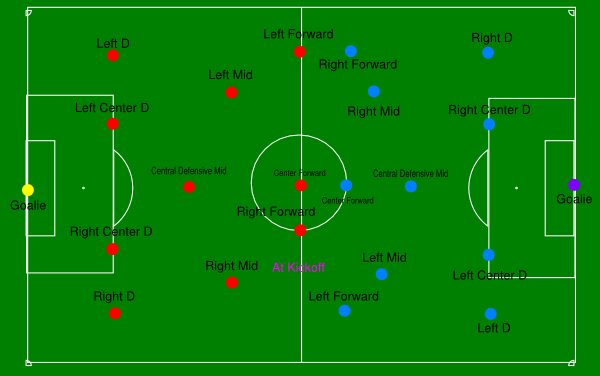
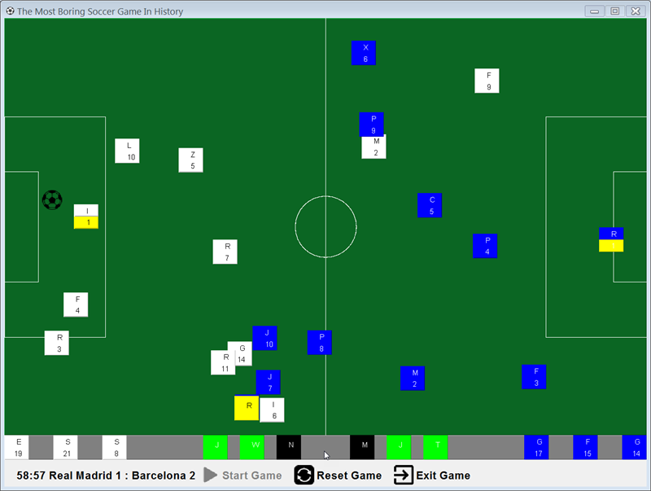

# Text Version: Winning Eleven

Welcome to Object Oriented Programming world! Let's design a simple soccer game using OOP design thinking.


You would have either played soccer or at least heard of this most popular sports game in the world. But
it's not that easy to organize a formal match. You need to prepare a lot of stuff, below is a minimum survival
task list:

+ Find a stadium where there is a formal soccer field with fixed width and length
+ Find two soccer teams, each team shall have one head coach, one or more assistant coach, 11 players and at least 3 substitutes
+ Coach should have attributes like name, age, how many champions won in his carrier
+ Each player should have his name, number, age, height(in cm), position(Forward, Midfielder, Defender, Goalie) in the field
+ Color of jerseys of the home team and the visiting team must be different and easy to recognize
+ Find one major referee, two linesman
+ Prepare at least one Size 5 soccer ball
+ Audiences: there would be many crazy soccer fans shouting there
+ Rules(only some of them, so that you will not be scared):
  + There will be two halves, each 45 minutes
  + If any of these criteria were matched then the game will be paused:
    + Soccer ball is out of the field
    + Referee whistles when one player fouls against another
  + If any team scores, game will stop for a while until then the other team kick off in the middle

Based on these minimum required classes and the simplified real-world example, please design a series of classes
to simulate a soccer game in text mode only.

```java
java Game
// When user input start, Start or START, prompt available teams for him to select
:user-input start
:system-out Here we go! Please select home team first:
:system-out Real Madrid, Barcelona, Manchester United, Chelsea, Juventus, AC Milan
:user-input Real Madrid or R or 1
:system-out You have selected Real Madrid as the home team.
:system-out Please select the visiting team then:
:system-out Barcelona, Manchester United, Chelsea, Juventus, AC Milan
:user-input Barcelona
:system-out You have selected Barcelona as visiting team
:system-out Please select the stadium for the match: San Siro, Nou Camp, Bernabeu, Old Trafford
:user-input Bernabeu or B or 3
:system-out Good job! All settle down. Game started.
```

Your code might be like this(just for your reference, you can do it on your own):
```java
public class Game {
    private Stadium stadium;
    private Team homeTeam;
    private Team visitingTeam;
    private SoccerBall ball;
    private Referee majorReferee;
    private Referee[] linesmen;
    
    public static void main(String[] args){
        Game game = new Game();
        Scanner scanner = new Scanner(System.in);
        while (scanner.hasNextLine()) {
            if (scanner.nextLine().equalsIgnoreCase("Start")) {
                System.out.println("Here we go! Please select home team first:\n" +
                    "Real Madrid, Barcelona, Manchester United, Chelsea, Juventus, AC Milan");
            }
            if (scanner.nextLine().equalsIgnoreCase("Real Madrid")) {
                Team homeTeam = new Team("Madrid");
                homeTeam.headCoach = ...;
                homeTeam.assistantCoaches = [...];
                homeTeam.players = [...];
                homeTeam.substitutes = [...];
                
                game.homeTeam = homeTeam;
            }
            // More stuff here and there...
        }
    }
    
}
```

You need to submit at least `Game.java`, `Stadium.java`, `SoccerBall.java`, `Team.java`, `Player.java`, `Coach.java` and `Referee.java`. You may
add other classes freely according to your own design, for example, the invisible `Rule` and visible `Audience`.

For `SoccerBall.java`, besides attributes of color and size, please maintain its location in the field, so that we can know whether it's a goal,
or still in the field, or out of field already.

### Challenge
Objects without behavior are simply dead. Can you try to simulate the match in text mode and respond to certain kinds of
events if they violate the rules declared?

```java
// ...simulate events of players: change their position randomly, choose their behaviors randomly, such as pass, shoot, foul and etc
:system-out Bale passes the ball to Benzema
:system-out Benzema shoots and...scores! Goal!
:system-out Now the score is Real Madrid 1 : 0 Barcelona
:system-out Messi fouls against Modric! Referee whistled!
:system-out Game paused for 30 seconds // Your program can sleep 30MS to simulate 30 seconds
......
:system-out The match ended with the score of Real Madrid 2:1 over Barcelona!
```

### Champion
Text output is not straightforward and cool, can you design a simple user interface to visualize the soccer game?

You can use squares of different colors to simulate players, a circle to simulate soccer ball. A black square for referee,
two yellow square at each line for the linesman.

You can draw all the lines to form a soccer field, and draw players of two teams, then make them move and move.😅



A very simple implementation looks like this:


